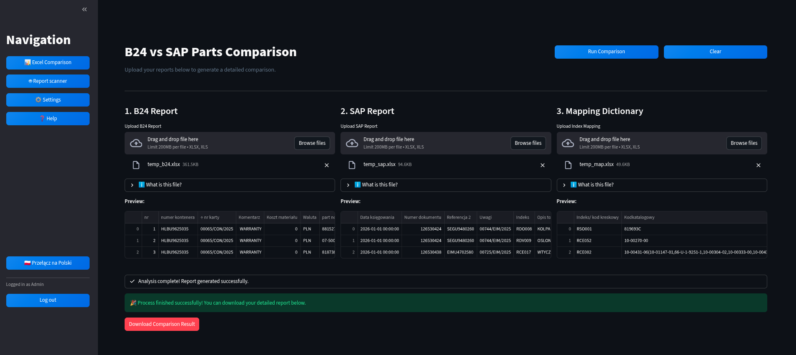
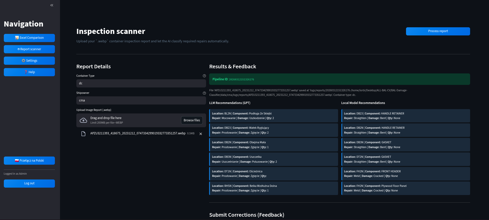
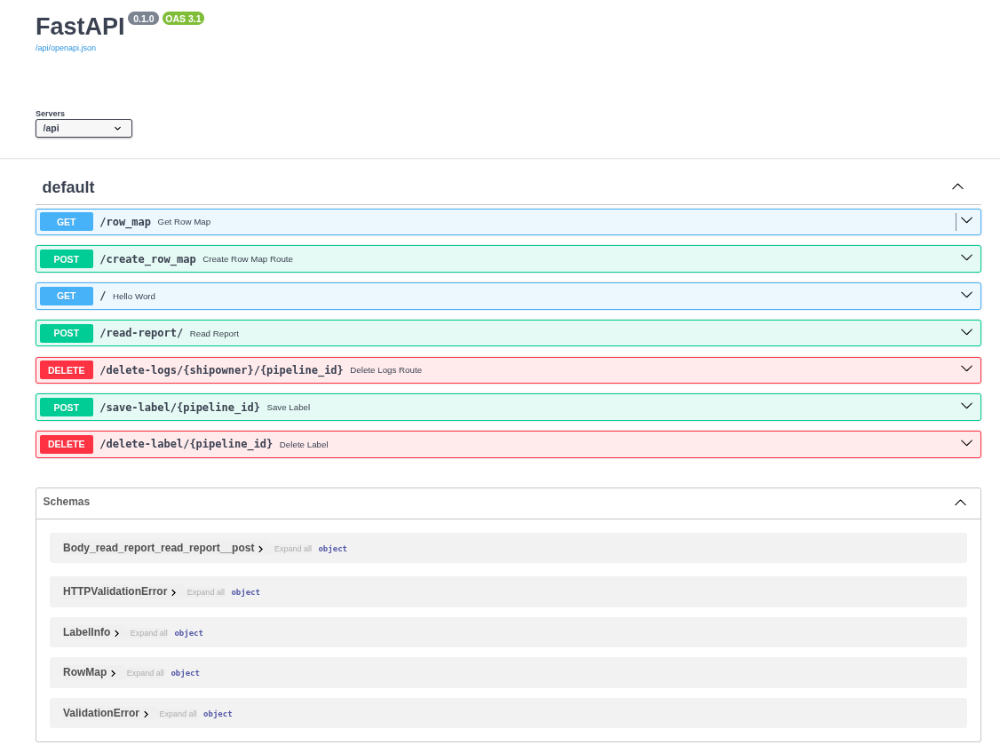

# Report Damage Classifier
App which identifies damages from a report picture.
## Quickstart:
 * copy **dev.env** rename to **.env** insert secrets
 * ensure all prerequisites such as docker, docker-compose, poetry, makefile, python3.10
 * create local environment: ```make venv```
 * start comparison interface: ```make ui```
 * build docker image: ```make build```
 * run docker image: ```make up```
 * run end to end integration tests: ```make test-integration```

Optional: 
 * run training ```make train```
 * information about commands: ```make help```

There is defined command line interface for quick app management:
```
@ML-model:~/ml$ make
Please use make target where target is one of:
board               open training monitoring board
build               build services
clean               clean all log files
down                down services
help                display this help message
test-integration    run functional integration tests
test-unit           run unit tests
test-vars           test variables
train               run training script
tune                run hyperparameter search
ui                  start Streamlit comparison interface
up                  set up composition
up-db               up only mongo service
venv                create poetry virtual environment

```
## File tree
```angular2html
 tree -I 'model|logs|__pycache__|exploration|reports_1|.pytest_cache|.git'

.
├── bitbucket-pipelines-dp.yml
├── bitbucket-pipelines.yml
├── data
│   ├── cma
│   │   ├── metadata_reports_1.json
│   │   ├── price_catalogues
│   │   │   ├── components_map.xlsx
│   │   │   ├── prices.xlsx
│   │   │   └── README.md
│   │   └── row_map_dataset.csv
│   ├── comparsion
│   │   ├── comparison_output.xlsx
│   │   ├── temp_b24.xlsx
│   │   ├── temp_map.xlsx
│   │   └── temp_sap.xlsx
│   └── docs
│       ├── 20240716020106114-CMAU3161209_412182_20231115_0931145343151520321252186-RBEN.png
│       ├── comparsion
│       │   ├── additional-rules.png
│       │   ├── desired_output.xlsx
│       │   ├── MAPOWANIE INDEKSOW.xlsx
│       │   ├── pipeline_test_output.xlsx
│       │   ├── project_plan.txt
│       │   ├── PRZYKLADY.xlsx
│       │   ├── Raport_części_chłodniczych___NA_DZIEŃ_2026-01-01_-_2026-02-19.xlsx
│       │   └── RAPORT SAP.xlsx
│       ├── interface-eng.png
│       ├── interface-eng-scan.png
│       ├── interface-pl.png
│       ├── processed_row.png
│       └── training_chart.png
├── deploy_dev.sh
├── dev.env
├── docker-compose.yml
├── Dockerfile
├── interface
│   ├── cli
│   │   └── comparser.py
│   ├── rest_api
│   │   └── app.py
│   └── streamlit
│       ├── app.py
│       ├── constants.py
│       └── utils.py
├── Makefile
├── nginx
│   └── nginx.conf
├── poetry.lock
├── poetry.toml
├── pyproject.toml
├── pytest.ini
├── README.md
├── src
│   ├── classifier
│   │   ├── config.py
│   │   ├── data_agumentation.py
│   │   ├── data_generator.py
│   │   ├── dataset.py
│   │   ├── encoder.py
│   │   ├── hyperparameter_tuning.py
│   │   ├── inference.py
│   │   ├── __init__.py
│   │   ├── model.py
│   │   ├── train.py
│   │   └── utils.py
│   ├── comparsion
│   │   ├── config.py
│   │   ├── __init__.py
│   │   ├── loaders.py
│   │   ├── matcher.py
│   │   ├── pipeline.py
│   │   ├── README.md
│   │   ├── rules.py
│   │   ├── transformers.py
│   │   └── writer.py
│   ├── config.py
│   ├── __init__.py
│   ├── parser
│   │   ├── errors.py
│   │   ├── __init__.py
│   │   ├── llm_api.py
│   │   ├── ocr.py
│   │   ├── pricer.py
│   │   ├── prompt.py
│   │   └── utils.py
│   ├── router.py
│   ├── schema.py
│   └── utils.py
└── tests
    ├── APZU3211393_418675_20231212_0747334299019332773351257.webp
    ├── __init__.py
    ├── integration_tests
    │   ├── delete_non_existing_rows.py
    │   ├── __init__.py
    │   ├── row_map_dataset_test.csv
    │   ├── test_app.py
    │   ├── test_logs.py
    │   ├── test_parser
    │   │   ├── __init__.py
    │   │   └── test_ocr.py
    │   └── test_save_label.py
    └── unit_tests
        ├── __init__.py
        └── test_dummy.py

19 directories, 85 files
```


## Environment Variables

To run this project, you will need to add the following environment variables to your .env file. Here's a table with examples and descriptions:

| Variable                   | Example Value                         | Description                                                      |
|----------------------------|---------------------------------------|------------------------------------------------------------------|
| `OPENAI_API_KEY`           | `sk-yourkeyhere123`                   | Your OpenAI API key, required for GPT-4. Available from the OpenAI API dashboard. |
| `GOOGLE_API_KEY `          | `key`                                  | Path to your Google Cloud credentials file. Required for accessing GCP Vision API. |
| `DEV_IP`                   | `192.168.1.100`                       | IP address of the development host machine.                      |
| `DEV_PROXY_IP`             | `192.168.1.101`                       | IP address of the proxy machine that forwards to the development host. |
| `DEV_LOGIN`                | `developer`                           | Username for logging into the development machine.               |
| `DEV_PASSWORD`             | `yourpassword`                        | Password for the development machine login.                      |
| `BITBUCKET_GIT_SSH_ORIGIN` | `git@bitbucket.org:balticonit/ml.git` | Git SSH origin URL for your repository on Bitbucket.         |
| `REPOSITORY_NAME`          | `ml`                                  | Name of the repository on Bitbucket.                             |
| `DB_USER`                  | `admin`                               | Username for the database login, typically an admin account.     |
| `DB_PASSWORD`              | `securepassword123`                   | Password for the database user.                                  |

Please ensure to replace the example values with actual data suitable for your environment.

Logs are created in **data/cma/logs/** directory.  

In **data/cma/price_catalogues** there need to be:
* components_map.xlsx
* prices.xlsx

Swagger and testing the endpoints:
http://0.0.0.0:8000/docs

## User Interfaces
This project provides multiple ways to interact with the core logic, showcasing a diverse set of interface development skills from interactive web applications to robust APIs and fast CLI tools.

### 1. Excel Comparison Application
An immersive, full-screen graphical interface built with Streamlit (`interface/streamlit/app.py`). It allows users to easily upload the B24, SAP, and Mapping files to execute the comparison logic defined in `src/comparsion`.



### 2. AI Scanner Report Application
Another Streamlit interface available within the main web app that handles visual inspection reports. Users can upload `.webp` files and configure container metadata, seamlessly integrating with the background AI processing pipeline.



### 3. REST API
A robust FastAPI backend (`interface/rest_api/app.py`) providing programmatic access to the Image Recognition API and data management workflows. Fully documented with interactive Swagger UI.



### 4. Command Line Interface (CLI)
For quick, scripted, and headless execution, a dedicated CLI `comparser.py` (`interface/cli/comparser.py`) is provided. It facilitates running comparisons directly from the terminal or CI/CD pipelines:
```bash
poetry run python -m interface.cli.comparser --b24 "Raport_B24.xlsx" --sap "RAPORT_SAP.xlsx" --map "MAPOWANIE.xlsx" --out "wynik.xlsx"
```

# Documentation for Image Recognition API
This API handles image processing, data management, and machine learning operations.

## 📁 Collection: Image Processing

### End-point: Welcome Screen
Simple endpoint to verify that the API is running.
#### Method: GET
>```
>{{URL}}/
>```

-------------------------------------------------------
### End-point: Read Report
Receives a report as a .webp file along with metadata, processes it with OCR, and generates repair recommendations.
#### Method: POST
>```
>{{URL}}/read-report/
>```
#### Form Data

|Param|value|
|---|---|
|container_type|rf|
|shipowner|cma|
|report|*binary data*|

#### 🔑 Authentication Bearer

|Param|value|Type|
|---|---|---|
|token|{{TOKEN}}|string|

-------------------------------------------------------

### End-point: Save Label Information
Saves label information based on the provided pipeline ID.
#### Method: POST
>```
>{{URL}}/save-label/{pipeline_id}
>```
#### Body (**raw**)

```json
[
    {
        "localisation": "DB1N",
        "component": "door",
        "repair_type": "replacement",
        "damage": "dent",
        "length": 15.5,
        "width": 7.2,
        "quantity": 2,
        "hours": "3",
        "material": "steel",
        "cost": "150"
    }
]
```

#### 🔑 Authentication Bearer

|Param|value|Type|
|---|---|---|
|token|{{TOKEN}}|string|

-------------------------------------------------------
### End-point: Delete Label Information
Deletes label information for a given pipeline ID.
#### Method: DELETE
>```
>{{URL}}/delete-label/{pipeline_id}
>```

#### 🔑 Authentication Bearer

|Param|value|Type|
|---|---|---|
|token|{{TOKEN}}|string|

-------------------------------------------------------


# Handwritten damage classifier model.

Series of experiments have been conducted and average evaluation loss from cross entropy 
loss function have been calculated on approximately 2600 records (20% of whole dataset).
Model which was trained was ResNet50 model from torchvision with default weights. 
```
models.resnet50(weights=models.ResNet50_Weights.DEFAULT)
```
Model have been trained to classify pictures of  handwritten damage text into metadata:

Pictures have been normalizing by mapping OCR (GCP cloud vision) box into 1000x1000 pixels white space which will allow different augmentation like rotating, flipping, adding distractions etx.
## Training ResNet model

### Overfitting problem 
There was no better weights addressed for that problem.
With initial training config the model have problem of overfitting 
and the validation loss was increasing with drastic spikes since epoch one. - **run_20240722-212617** , **run_corpora**

This problem have been resolved by adjusting the learning rate
* 0.00001 which significantly improve the learning graph, weight_decay 0.1- **run_grindable**
* 0.000001  had smooth graph but val error was higher - **run_corpora**
* 0.0005 gave good results too.  


### Unbalanced classes problem
The dataset had problem of unbalanced classes, there were 
```
location,component,repair_type,damage,counts
BL12,Plywood Floor Panel,Patch,Cracked,8
BL12,Plywood Floor Panel,Patch,Improper Repair,3
BL12,Plywood Floor Panel,Refit,Loose,2
BL12,Plywood Floor Panel,Replace,Holed,1
BL12,Plywood Floor Panel,Seal,Leak,2
BL13,Plywood Floor Panel,Patch,Cracked,2
BL13,Plywood Floor Panel,Replace,Cracked,1
BL1N,CLEANING,Remove,Debris,1
BL1N,Plywood Floor Panel,Patch,Cracked,1
BL1N,Plywood Floor Panel,Refit,Loose,5
BL1N,Plywood Floor Panel,Remove,Nails,1
BL23,Plywood Floor Panel,Patch,Cracked,12
BL23,Plywood Floor Panel,Replace,Cracked,1
```
Which afer drop each category to the only one which have more than 10 picture examples looked like this:
```
location,component,repair_type,damage,counts
BL23,Plywood Floor Panel,Patch,Cracked,12
BL2N,Plywood Floor Panel,Patch,Cracked,11
BL3N,Plywood Floor Panel,Refit,Loose,11
BL5N,Plywood Floor Panel,Refit,Loose,19
BR12,Plywood Floor Panel,Patch,Cracked,15
BR23,Plywood Floor Panel,Patch,Cracked,19
BR3N,Plywood Floor Panel,Refit,Loose,10
BX10,CLEANING,Remove,Debris,11
```
This made problem around 10 times less complicated, rather than recognizing 1407 different examples we recognize 177.
So 1230 examples appear less than 10 times in the past - depends on end user if it is important to recognize these once, 
but for improving metrics dropping them can be valuable.

To address imbalanced classes problem stratified k-fold cross validation was introduced and trained with split for 3 and 5 folds.

### Experiments
There were experiments with data augmentation for the pictures which less than 50 count, but at the end it was too heavy for algorithm
and the model overfit to synthesised examples rather than from real distribution which lead to increasing validation error.
It also increases significantly the training time (around 7 days of training vs 2 day with normal config)

To lower the validation error I tried dropout value 0.5 it was too aggressive for a simple ResNet model. 
Maybe for more complex models with more hidden layers like CRN it can be valuable.

During experiments checkpoints which can be resumed was saved each 3 epochs and then model with lowest validation error 
has been chosen which was the sort of early stopping.

### Orchestrating model training
The hyperparameter search with HyperOpt have been implemented which will automate process of parameter searching, but can take up to 1 month 
of constant running. It is scheduled by **bitbucket pipelines**.
The final set of hyperparameters chosen for the **CMA** shipowner is:
```
{
    "shipowner": "cma",
    "num_checkpoints": 3,
    "with_augmentation": false,
    "k_fold": 1,
    "num_epochs": 30,
    "resume_run": null,
    "learning_rate": 5e-05,
    "batch_size": 16,
    "dropout_rate": null,
    "weight_decay": 0.1,
    "drop_categories": 10
}
```
It is necessary to train one model for each shipowner which will be located in **data/** directory
with defined subdirectories and managed by **git LFS** for now until the repository have 4 GB.
After it will be necessary to use GCP bucket.

### Ideas for further improvement:
 - use different architecture which is pretrained on recognizing handwritten text like CRN.
 - iterate through data and delete pictures which contain only code and no damage description
 - feedback from users which model is working better for this task: local model vs gpt-4o
 - more experiments with batch sizes and different k fold splits
 - open question is if there are multiple types of containers f.e. RF and DC, is the damage with same code like DB1N can mean different damages for them?

# Architecture and MLOps Best Practices
The project infrastructure takes full advantage of cloud-native architecture via `docker-compose.yml`, laying down a solid foundation for robust MLOps operations:

* **Nginx** (Reverse Proxy): Operates as the secure API Gateway routing traffic internally. This isolates the internal microservices (`app` and `ui`) from direct public internet exposure, gracefully load balances inbound HTTP traffic, and allows future seamless inclusion of TLS cryptography.
* **MongoDB** (NoSQL Document Store): AI pipelines inherently deal with unstructured data, continuous schema transformations, and varying damage predictions. Storing labels in traditional SQL tables introduces harsh migration complexities. MongoDB’s JSON/BSON-like document architecture perfectly mirrors the dynamic nested JSON outputs emitted by models and GPT-4.
* **Container Segregation Strategy**: Decomposed the environment into dedicated containers (`app`, `ui`, `mongo`, `nginx`) encapsulating their specific dependencies. This best practice completely sidesteps dependency hell and supports scalable horizontal distribution later onto Kubernetes or AWS ECS with minimal refactoring.
* **Health Checks & Recovery**: Docker compose ensures each service contains distinct `healthchecks` alongside `restart: on-failure` policies meaning transient API interruptions natively self-heal.

# Prerequisites on Host:
 * python 3.11
 * make
 * docker 
 * docker compose
 * access to Bitbucket repository - ssh token configured
 * poetry
```
sudo apt update
sudo apt install pipx
pipx ensurepath
sudo pipx ensurepath --global # optional to allow pipx actions in global scope. See "Global installation" section below.
pipx install poetry
```
 * `sudo apt-get install sshpass`
 * manage docker as non root user:
```
sudo groupadd docker    
sudo usermod -aG docker $USER  
newgrp docker
docker run hello-world
```